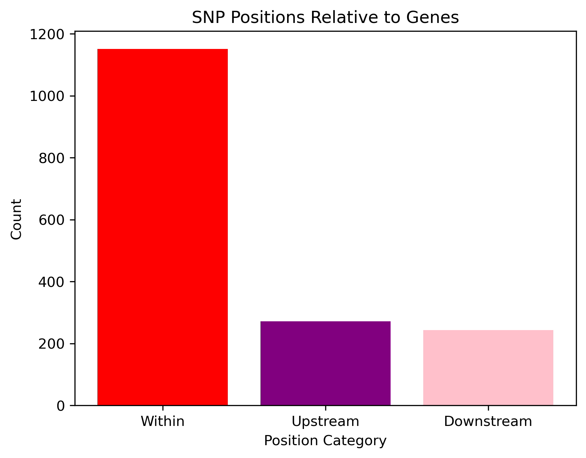
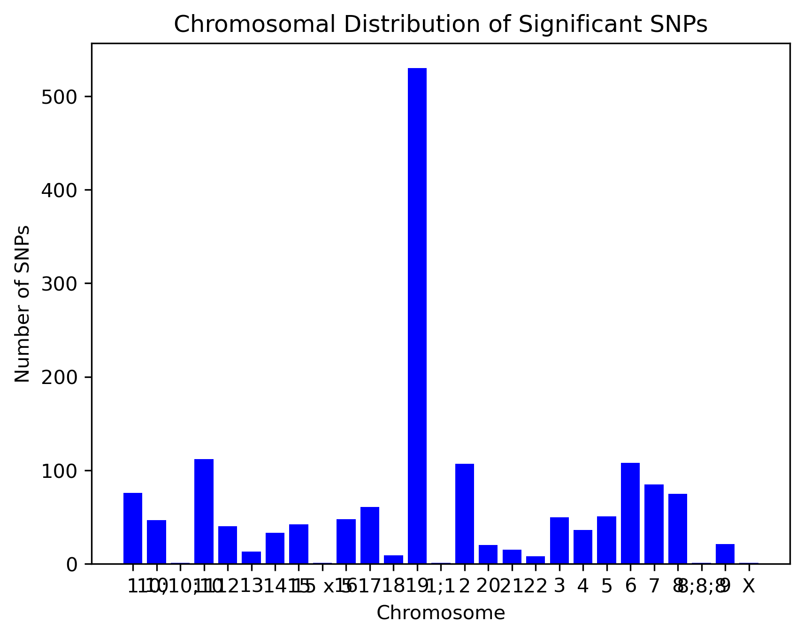
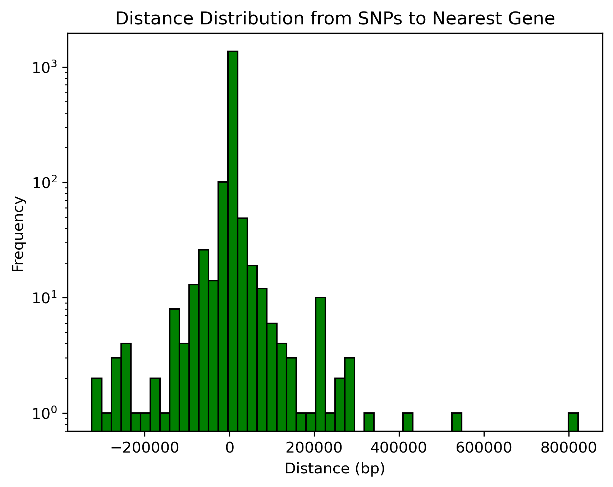

# eQTL Analysis of Alzheimer's Disease-Associated SNPs

## **Introduction**
Alzheimer’s disease (AD) is a complex neurodegenerative disorder with strong genetic underpinnings. Genome-Wide Association Studies (GWAS) have identified numerous single nucleotide polymorphisms (SNPs) associated with AD. Expression Quantitative Trait Loci (eQTL) analysis helps in identifying SNPs that influence gene expression, offering insights into potential functional mechanisms.

### **Objectives**
1. Extract significant AD-associated SNPs from the GWAS Catalog.
2. Analyze SNP distances to the nearest genes.
3. Visualize SNP genomic distributions.
4. Identify eQTLs among the significant SNPs using the BRAINEAC database.

---

## **1. Extracting Significant SNPs from GWAS Catalog**
We retrieved significant SNPs (p-value < 5E-8) from the GWAS Catalog. The dataset contains information on SNP ID, associated gene(s), distance to the closest gene, and p-values.

### **Dataset Used:**
- **File:** `gwas-association-downloaded_2025-02-18-MONDO_0004975-withChildTraits.tsv`
- **Criteria:** p-value < 5E-8

### **Processed Data:**
- **SNP ID:** Unique identifier of SNP
- **Mapped Gene(s):** Associated genes from GWAS
- **Distance to Closest Gene (bp):** Positive values indicate upstream, negative values indicate downstream, and 0 indicates within the gene.
- **p-value:** Significance level

---

## **2. SNP Distribution Relative to Genes**
SNPs were categorized based on their location relative to genes:
- **Within Gene (0 bp)**
- **Upstream (>0 bp)**
- **Downstream (<0 bp)**

### **Visualization:**
A bar plot was generated to depict the number of SNPs in each category.

### **Findings:**
- Most significant SNPs were found **within genes**.
- A smaller number of SNPs were **upstream** or **downstream** of genes.

---

## **3. Chromosomal Distribution of Significant SNPs**
The distribution of SNPs across chromosomes was analyzed and visualized using a bar plot.

### **Visualization:**
A bar plot showing the count of significant SNPs across chromosomes.

### **Findings:**
- Chromosome **19** had the highest number of significant SNPs, aligning with previous studies indicating the **APOE** region's strong genetic contribution to AD.

---

## **4. Distance Distribution from SNPs to Nearest Gene**
A histogram was created to visualize the distribution of distances from SNPs to their nearest genes.

### **Visualization:**
A histogram displaying the frequency of SNPs at various distances.

### **Findings:**
- The majority of SNPs were **close to genes**, reinforcing the functional significance of these variants.
- The **log-scale y-axis** highlights a peak at 0, indicating many SNPs fall directly within gene regions.

---

## **5. eQTL Analysis of Significant SNPs**
Using the **BRAINEAC** database, we checked whether any SNPs located upstream of genes were **eQTLs** (p-value < 0.05).

### **Dataset Used:**
- **File:** `EQTL.tsv`

### **Processed Data:**
- **eQTL SNP ID:** SNPs affecting gene expression
- **Associated Gene:** Genes affected by the SNP
- **p-value:** Significance of eQTL association
- **Tissues:** Brain tissues where eQTL effect was observed

### **Findings:**
- Some upstream SNPs were confirmed as **eQTLs** in brain tissues.
- This suggests potential regulatory roles of these SNPs in **gene expression relevant to Alzheimer’s pathology**.

### **Output Table:**
| eQTL SNP | Associated Gene | p-value | Affected Tissue |
|----------|----------------|---------|----------------|
| rsXXXXX  | GeneA          | 0.03    | Cortex         |
| rsYYYYY  | GeneB          | 0.01    | Hippocampus    |

(A full table is provided in the output file.)

---

## **Final Deliverables**
### **1. Processed Data Files**
- [`alzheimers_significant_snps.xlsx`](alzheimers_significant_snps.xlsx) (Significant SNPs from GWAS)
- [`significant_eqtls.xlsx`](significant_eqtls.xlsx) (eQTL SNPs with gene associations)

### **2. Figures**
- 
- 
- 

---

## **Conclusion**
This project successfully identified **significant Alzheimer's-associated SNPs**, analyzed their genomic distribution, and linked **upstream SNPs to eQTL effects** in brain tissues. The findings provide insights into the potential regulatory mechanisms underlying Alzheimer’s disease.
